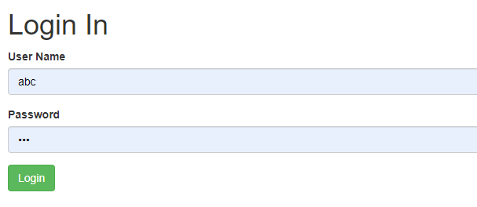
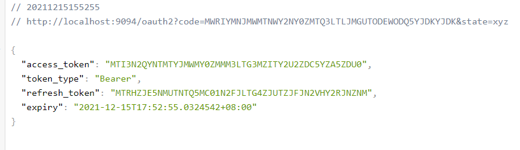

# Go-Oauth2-Project
go-oauth2 +gin

参考 https://github.com/go-oauth2/oauth2

## 安装

```
go get -u -v github.com/go-oauth2/oauth2/v4/...

go get -u github.com/gin-gonic/gin
```

## 运行

分别进入client和servier目录运行启动代码

```
go run .\client.go

go run .\server_gin.go
```

### 打开浏览器

访问http://localhost:9094/ 

开始认证



认证成功 返回token


