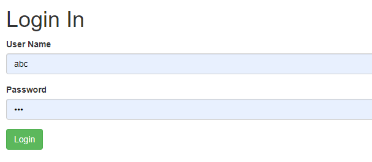
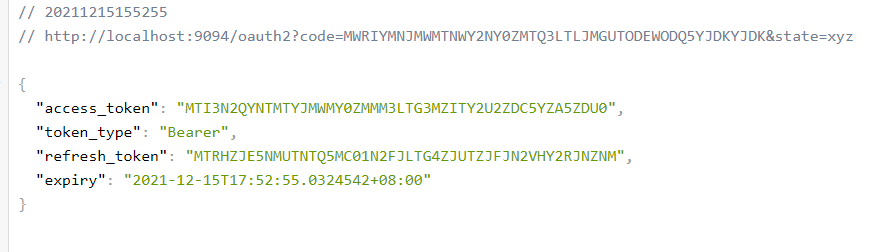
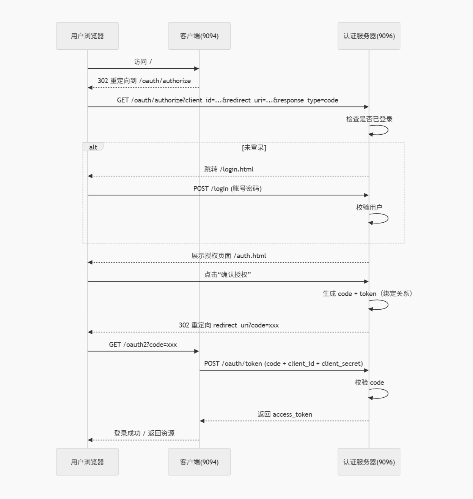

# Go-Oauth2-Project
go-oauth2 +gin

参考 https://github.com/go-oauth2/oauth2

## 安装

```
go get -u -v github.com/go-oauth2/oauth2/v4/...

go get -u github.com/gin-gonic/gin
```

## 运行

分别进入client和servier目录运行启动代码

```
go run .\client.go

go run .\server_gin.go
```

### 打开浏览器

访问http://localhost:9094/ 

开始认证



认证成功 返回token



```
{
  "access_token": "MTQ2MGUXODATOGNJYI0ZZJYWLTLHMJMTNDCWYZBINWJLYZJH",
  "token_type": "Bearer",
  "refresh_token": "YWYXOWQWYMQTMTHHYS01NZU4LTGYNWUTNDJIYZFJNGE1NMY2",
  "expiry": "2021-12-15T18:01:20.4626723+08:00"
}
```

## 流程



客户端服务器监听9094端口

认证服务器监听9096端口

### 第一步

用户访问**客户端** http://localhost:9094/ 
9094的/ 这个接口，会构造新的url，重定向到端口 9096 的认证 的服务器,实际就是oauth2协议的第一个接口/authorize
client_id:必填

response_type：必填

redirect_uri：可选（没有服务器有默认的）

例如

redirect_uri=http://localhost:9094/oauth2

```
http://localhost:9096/oauth/authorize?client_id=222222&redirect_uri=http%3A%2F%2Flocalhost%3A9094%2Foauth2&response_type=code&scope=all&state=xyz
```

### 第二步

进去**认证服务器**/authoriz接口

1. 首先判断有没有登录过
   1. 没登陆过直接跳转到登录页面
   2. 输入完账号密码，点击登录，进入后端校验接口
   3. 校验完成，再重定向到是否**允许授权**页面(前端页面)，
   4. 点击确认授权后，再次重定向/authorize

2. 生成code和token，一一对应
3. 重定向到redirect_uri并且带上code(http://localhost:9094/oauth2?code =code )

## 第三步

客户端服务器

进入重定向的接口，
通过传入的code，再加上client_id,client_secret等参数去认证服务器的接口/token  请求一个token，
然后返回出来

